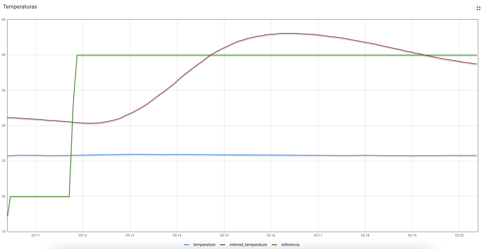
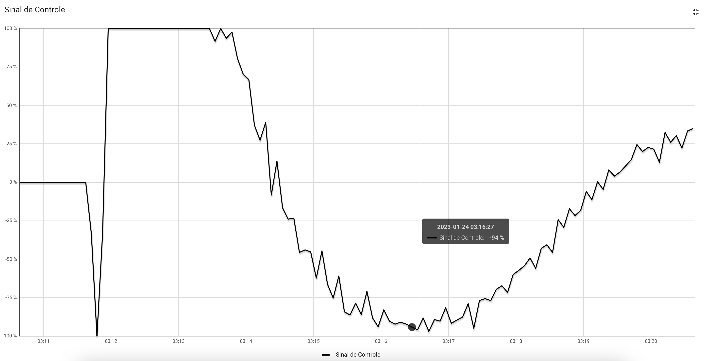
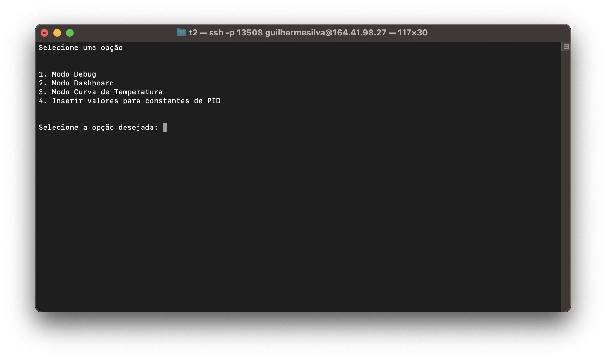
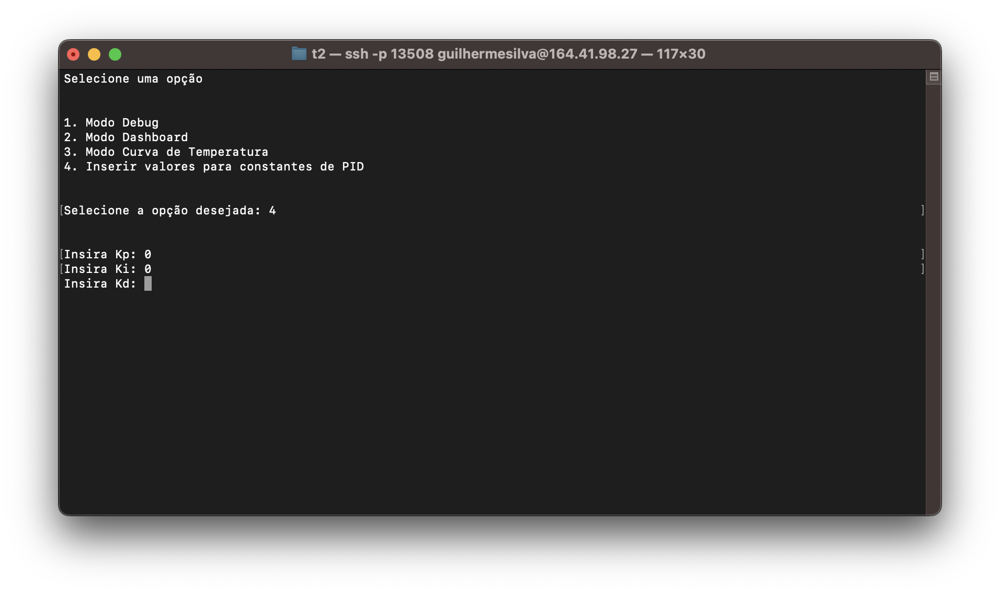

# Fundamentos de Sistemas Embarcados (FSE)
Trabalho 2 de Fundamentos de Sistemas Embarcados
## Pré-requisitos
- Biblioteca Python BME280: 
```
pip install RPi.bme280
```
- Biblioteca Python RPi.GPIO: 
```
pip install RPi.GPIO
```
- Biblioteca Python SMBus2: 
```
pip install smbus2
```
- Python 3.9.2

## Instalação
1. Clonar o repositório com o comando: 
```
git clone https://github.com/guilhermedfs/T2-FSE-FORNO.git
```

**Obs:** Necessário instalar as dependências citadas anteriormente.

## Execução

1. Entrar na pasta do projeto: 
```
cd T2-FSE-FORNO
```
2. Executar o programa:
```
python3 main.py
```

## Gráficos

|  | 
|:--:| 
| Gráfico de Temperatura |

|  | 
|:--:| 
| Gráfico de Controle |

## Interface

|  | 
|:--:| 
| Menu |

|  | 
|:--:| 
| Alteração de constantes K |